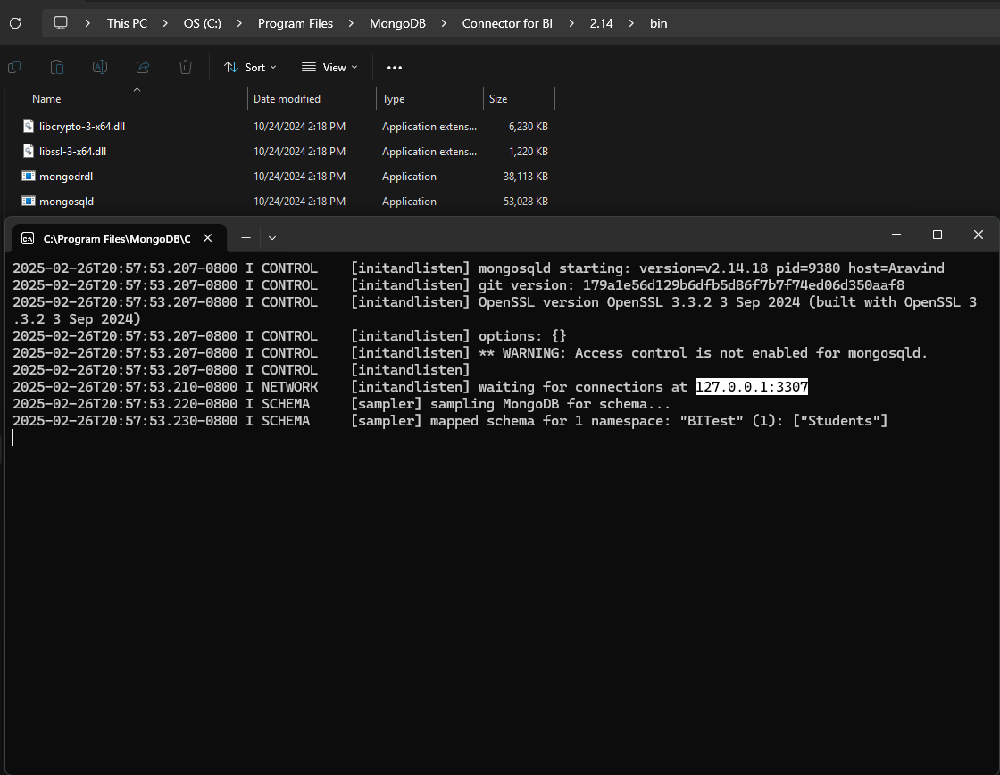
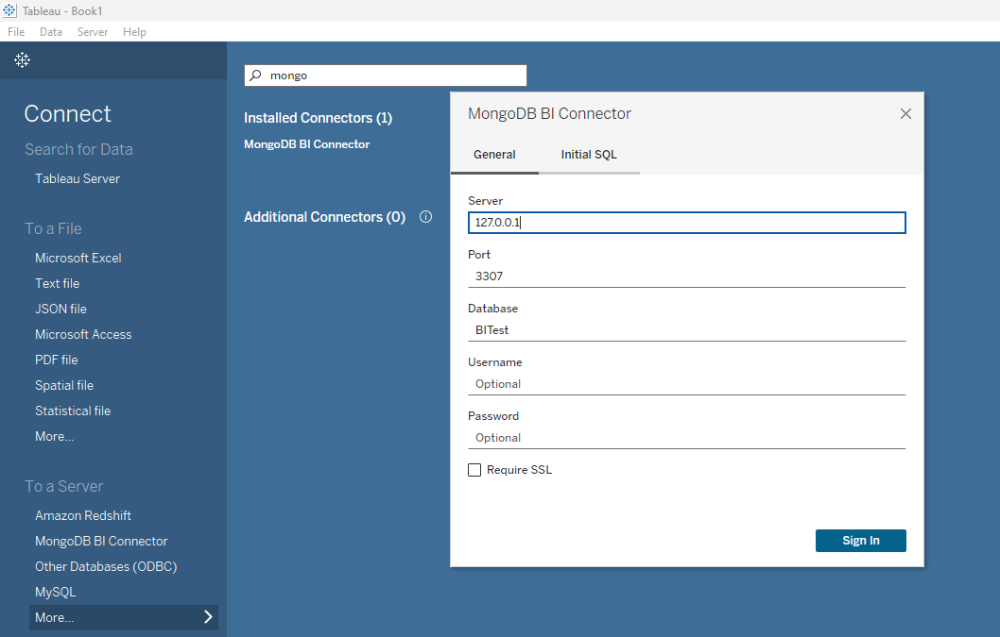
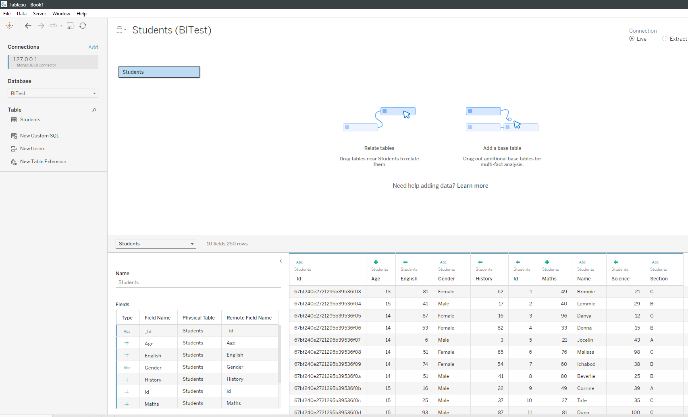
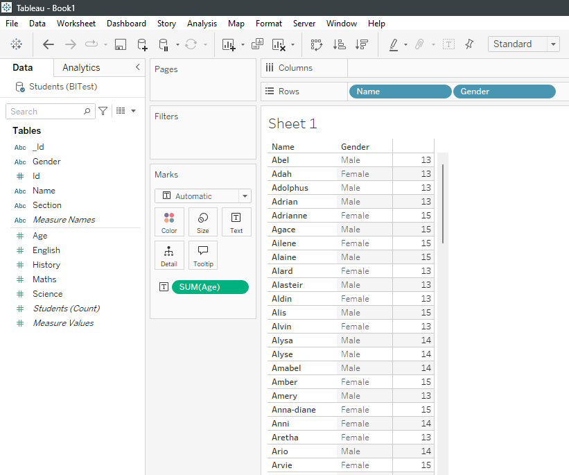
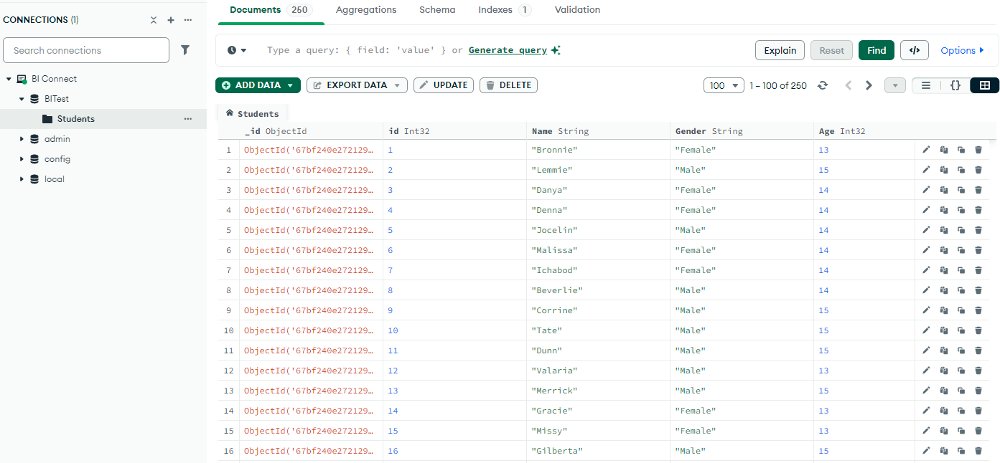

# Tableau-MongoDB-Connection
Tableau MongoDB Connection – A step-by-step guide on connecting Tableau to a MongoDB. 🚀 
 
## Prerequisites  

- **MongoDB** installed  
- **Tableau** installed  
- **MongoDB BI Connector** installed – [Download Here](https://www.mongodb.com/try/download/bi-connector)  

## Steps to Connect Tableau to MongoDB  

### 1. Run the MongoDB BI Connector (`mongosqld`)  

- Navigate to the following path on your system:  
  ```
  C:\Program Files\MongoDB\Connector for BI\2.14\bin\
  ```  
- Double-click **`mongosqld.exe`** to run it.  
- If you installed it in a different directory, update the path accordingly.  
- The server and port will be displayed in the terminal. 





### 2. Connect Tableau to MongoDB  

- Open **Tableau Desktop**.  
- Click on **More...** under "To a Server".  
- Select **MongoDB BI Connector**.  
- Enter the following details:  
  - **Server**: Use the value shown in the `mongosqld` terminal.  
  - **Database Name**: Enter the name of the MongoDB database you want to connect to.  
- Click **Sign In**.  
- Done! Your MongoDB database is now connected to Tableau.  








## Confirmation 

 
  





## Troubleshooting Tips  

- Ensure `mongosqld` is running before connecting.  
- Use the correct **server address** and **port** from the `mongosqld` terminal.  
- If connection issues occur, check **firewall settings** and **driver compatibility**.  

## Author  

[Aravind R](https://linkedin.com/in/arav-r) 

